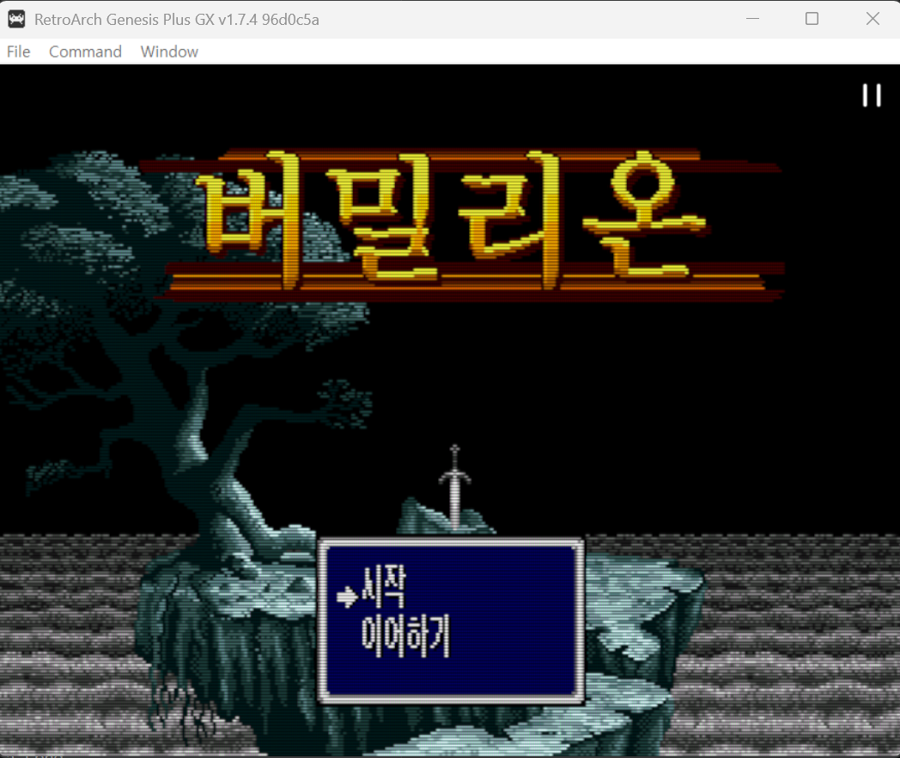

# 대한글화시대 (大한글化時代) ⚓🕹️

> 미번역의 바다를 항해하며, 레트로 게임 한글화의 신항로를 개척합니다.

레트로 게임 한글화 패치 모음집입니다.

- 패치 파일만 배포합니다. **게임 롬/원본 파일은 포함하지 않습니다.**
- 각 게임 폴더의 README에서 적용 방법·원본 정보·스크린샷을 확인할 수 있습니다.
- 폴더 구조: `시스템/게임` (예: `md/vermilion`, `dos/jones-in-the-fastlane`)

## 게임 목록

| 게임 | 시스템 | 버전 | 상태 | 다운로드 |
|------|--------|------|------|----------|
| [<br>**버밀리온 (Vermilion)**](md/vermilion/) | 메가드라이브 | v0.9 | 테스트 중 | [Release](https://github.com/evegood99/KR_PATCH_AGES/releases/tag/vermilion-v0.9) |
| [<br>**존의 사생활**](dos/jones-in-the-fastlane/) | DOS | v0.9 | 1차 검수 완료 | [Release](https://github.com/evegood99/KR_PATCH_AGES/releases/tag/jones-in-the-fastlane-v0.9) |

## 패치 적용 방법 (공통 — xdelta 형식)

1. [Delta Patcher](https://github.com/marco-calautti/DeltaPatcher/releases) (GUI) 또는 `xdelta3` (CLI) 준비
2. 각 게임 README에 적힌 **원본 해시(MD5)** 와 자신의 파일이 일치하는지 확인
3. 패치 적용:
   ```
   xdelta3 -d -s <원본> <패치.xdelta> <출력>
   ```
   (게임별 형식이 다르면 해당 게임 README의 적용법을 따르세요)

## 면책

- 이 저장소는 **패치 파일만** 제공합니다. 게임은 직접 소유한 원본을 사용하세요.
- 각 게임의 저작권은 원 저작권자에게 있습니다. 패치는 비영리 팬 번역입니다.
