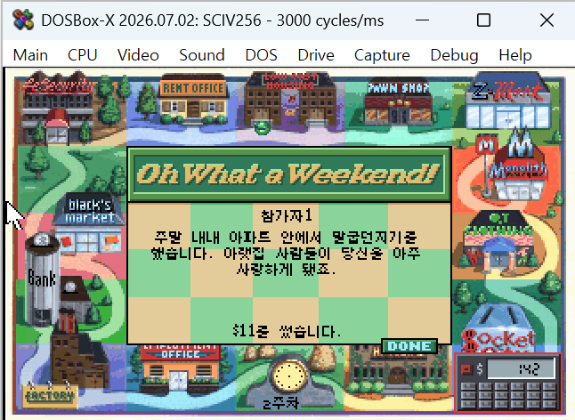
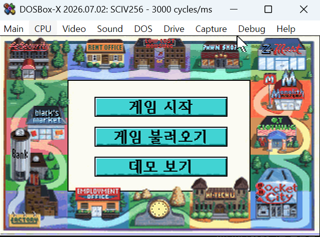
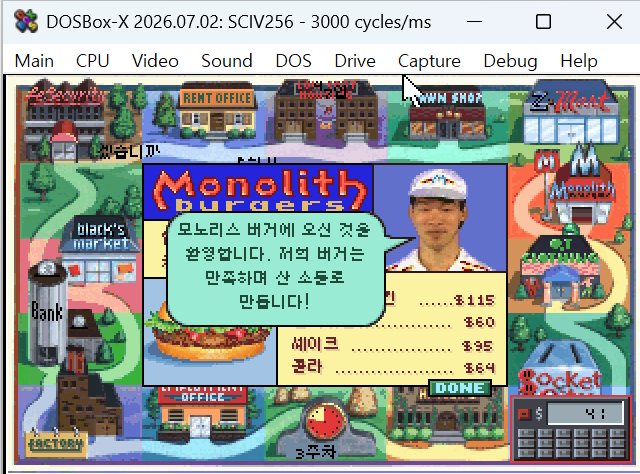
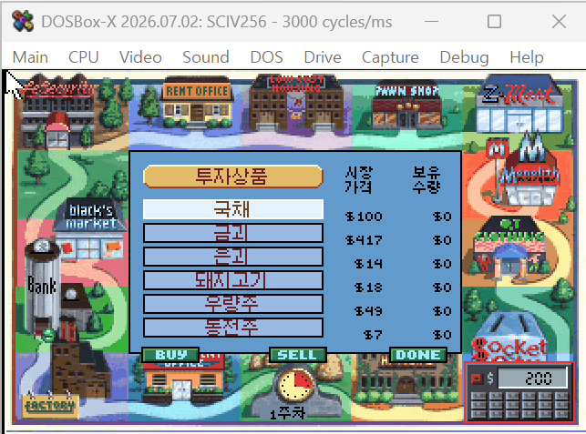
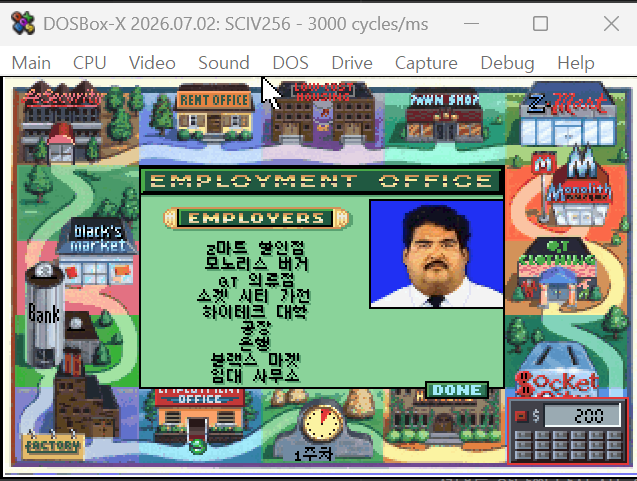
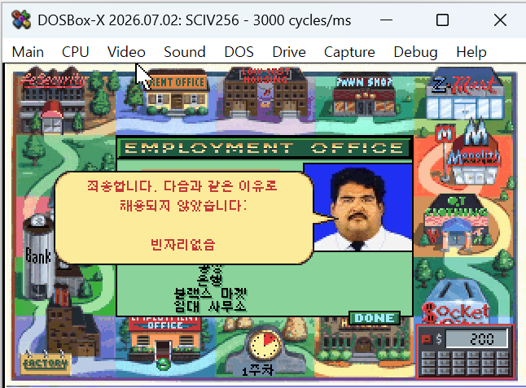
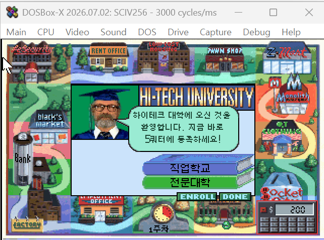
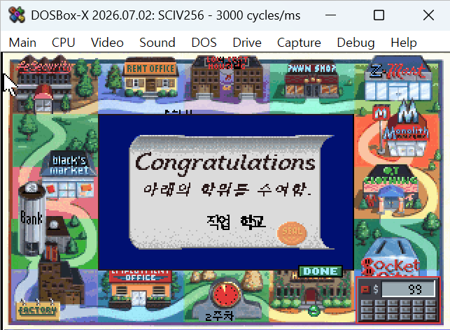

# 존스 인 더 패스트레인 (Jones in the Fast Lane) 한글화 패치

시에라 1990년작 DOS 보드게임형 인생 시뮬레이션 **Jones in the Fast Lane**(SCI1 엔진)의 한글화 패치입니다.

- **현재 버전**: v0.9 (1차 검수 완료)
- **패치 형식**: xdelta 4개 + 적용 배치 (원본 게임 파일 4개를 교체)
- **방식**: ScummVM 없이 **원본 DOS SCI1 인터프리터(`sciv256.exe`)를 직접 패치**해
  DOSBox/실제 DOS에서 한글(EUC-KR 완성형)을 네이티브 렌더링

## 스크린샷

| | |
|---|---|
|  |  |
|  |  |
|  |  |
|  |  |

## 원본 게임 정보

패치는 아래 원본에만 적용됩니다. 적용 전 해시를 확인하세요.

```
resource.001    313,476 bytes   MD5 56166eb58bc48f072cfd77e4aa1418d7
resource.002    719,747 bytes   MD5 e6ce044e9924c646ee3b66502c49fe5a
resource.map      1,800 bytes   MD5 65cbe19b36fffc71c8e7b2686bd49ad7
sciv256.exe      60,373 bytes   MD5 c4fecc0322c70e74ed48daee97c76a99
```

패치 적용 결과물:

```
resource.001    447,923 bytes   MD5 85a73e06416ac43b5dbab4dd20216b9b
resource.002    975,189 bytes   MD5 79ece90e6a4d20f543467bb7471520a2
resource.map      1,800 bytes   MD5 290e13e45228af46d9fd3286939a5d23
sciv256.exe     115,284 bytes   MD5 5b381fbc277b165ba1e5852f0bda92d4
```

## 다운로드

패치 파일은 **[Releases](https://github.com/evegood99/KR_PATCH_AGES/releases/tag/jones-in-the-fastlane-v0.9)** 에서 받으세요:
`jones_kr_v0.9.zip`

## 적용 방법

**배치 (권장)**
1. zip을 풀어 **게임 폴더에 통째로 복사** — `적용.bat`, `복원.bat`, `patch/` 가 `resource.001` 과 같은 위치에 오도록
2. `적용.bat` 실행
3. 되돌리려면 `복원.bat` 실행 — 원본은 `*.bak` 으로 백업됩니다

원본 해시를 자동 대조하고, 이미 적용된 상태면 중단하며, 실패 시 자동 원복합니다.

**CLI** — [xdelta3](https://github.com/jmacd/xdelta) 직접 사용
```
xdelta3 -d -s resource.001 patch/resource.001.xdelta resource.001.new
xdelta3 -d -s resource.002 patch/resource.002.xdelta resource.002.new
xdelta3 -d -s resource.map patch/resource.map.xdelta resource.map.new
xdelta3 -d -s sciv256.exe  patch/sciv256.exe.xdelta  sciv256.exe.new
```
생성된 `.new` 를 원본 이름으로 교체하세요.

## 실행 방법

```
sciv256 -w 0 0 200 320
```
원본 `sierra.bat` 과 동일한 인자입니다. `-w` 뒤 네 숫자는 창 사각형(top, left, bottom, right)으로 320x200 전체 화면을 뜻합니다.

DOSBox-X 권장 설정:
```
[dosbox]
machine=svga_s3
[cpu]
cycles=fixed 3000
[sblaster]
sbtype=sb16
```
cycles가 높거나 사운드가 설정되지 않으면 게임이 멈출 수 있습니다.

> **ScummVM에서는 동작하지 않습니다.** 원본 DOS 인터프리터를 직접 패치하는 방식입니다.

## 한글화 내용

**텍스트**
- 전체 텍스트/스크립트 리소스 번역 — 상점 대사, 신문 헤드라인, 대학, 은행, 전당포, 직업소개소, 도움말
- 게임 내장 폰트 8종을 EUC-KR 완성형으로 확장 (사용 음절만 포함)

**그래픽 문구** (뷰 리소스 직접 편집)
- 타이틀 메뉴 — 게임 시작 / 게임 불러오기 / 데모 보기
- 보드 이벤트 안내문 14종 — 집세 납부일, 음식 상함, 감봉, 복권 당첨 등
- 졸업장 학위 수여 문구와 학위명
- 대학 과목명 11종, 전당포 메뉴, 중개인 투자 항목 6종

**레이아웃 보정**
- 상점 가격·직업 시급 우측정렬, 점선 리더 폭 재계산
- 직업소개소 고용주 목록, 은행 메뉴, 중개인 컬럼 헤더 정렬
- STATISTICS 화면 1열 배치 복원

## 기술 개요

- LZEXE 0.91 압축 실행파일 해제 후 인터프리터 직접 패치
- 모든 텍스트가 거치는 **글리프 블릿 단일 지점**에 상태기반 래퍼 삽입 →
  EUC-KR 2바이트(lead 0xB0–0xC8) 조합 렌더링, 텍스트 경로와 무관하게 한글 출력
- 폭 측정 루틴(`TextWidth`)에도 케이브를 넣어 한글 폭을 반영 — 워드랩·중앙정렬 정상화
- 리소스 볼륨은 **원본 배치를 보존**하며 재작성(제자리 교체, 넘치면 볼륨 끝에 추가)해
  패치 델타를 192KB로 유지

## 알려진 제한

- **채용 거절 사유 4개는 영문 유지** — 한글에 띄어쓰기가 들어가면 렌더가 깨집니다
- **난이도 선택(take it easy / play fair / go for broke)과 yes/no 버튼은 영문** —
  한글 그래픽 적용 시 선택 후 게임이 멈추는 문제가 있어 보류
- 상점 하단 `PAWN` / `DONE` / `EXIT` 등 일부 UI 버튼 영문
- 대화 텍스트는 8px 고정 — 화면별 글자 크기 조정은 미지원

## 변경 이력

### v0.9 (2026-07-27)
- 최초 공개 테스트 버전
- 네이티브 EUC-KR 렌더링(블릿 래퍼 + 폭 측정 케이브)
- 전체 텍스트/스크립트 번역, 그래픽 문구 한글화, 레이아웃 보정
- 원본 볼륨 배치를 보존하는 재작성으로 패치 용량 최소화
