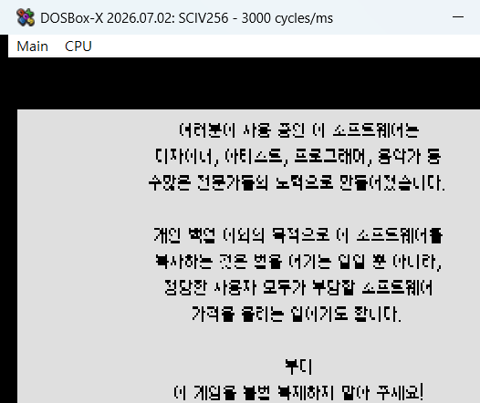
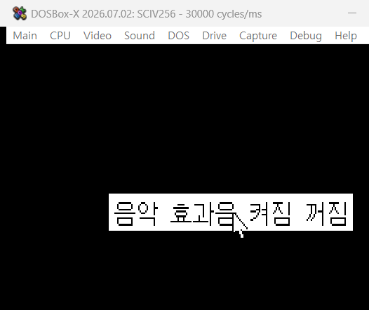
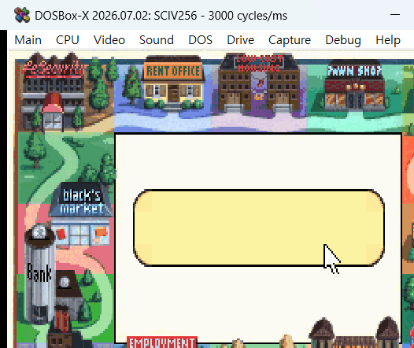

# 존스 인 더 패스트레인 (Jones in the Fast Lane) 한글화 패치

시에라 1990년작 DOS 보드게임형 인생 시뮬레이션 **Jones in the Fast Lane**(SCI1 엔진)의 한글화 패치입니다.

- **현재 버전**: 개발 중 (배포 준비 전)
- **방식**: ScummVM 없이 **원본 DOS SCI1 인터프리터(`sciv256.exe`)를 직접 패치**해
  DOSBox/실제 DOS에서 한글(EUC-KR 완성형)을 네이티브 렌더링

## 스크린샷

| | |
|---|---|
|  |  |
|  | |

## 기술 개요

- LZEXE 0.91 압축 실행파일 해제 후 인터프리터 직접 패치
- 모든 텍스트 루틴이 거치는 **글리프 블릿 단일 지점**에 상태기반 래퍼(44B) 삽입 →
  EUC-KR 2바이트(lead 0xB0-0xC8) 조합 렌더링, 어떤 텍스트 경로든 한글 출력
- 한글 폰트(`korean.fnt`) + 스크립트 리소스 번역 교체

## 실행 방법 (개발 빌드)

DOSBox 권장 설정:
```
[dosbox]
machine=svga_s3
[cpu]
cycles=fixed 3000
[sblaster]
sbtype=sb16
```
(cycles가 높거나 사운드 미설정 시 게임이 멈출 수 있음)

## 배포 계획

- 원본 게임 파일 대비 **교체/패치 파일 묶음** 형태로 배포 예정 (형식 확정 중)
- 원본 식별 정보(해시)와 적용 도구는 배포 시 함께 안내

## 변경 이력

### (개발 중)
- 네이티브 한글 렌더링 동작 확인 (저작권 화면·대화 제목·건물 메시지 등)
- 번역 작업 진행 중
