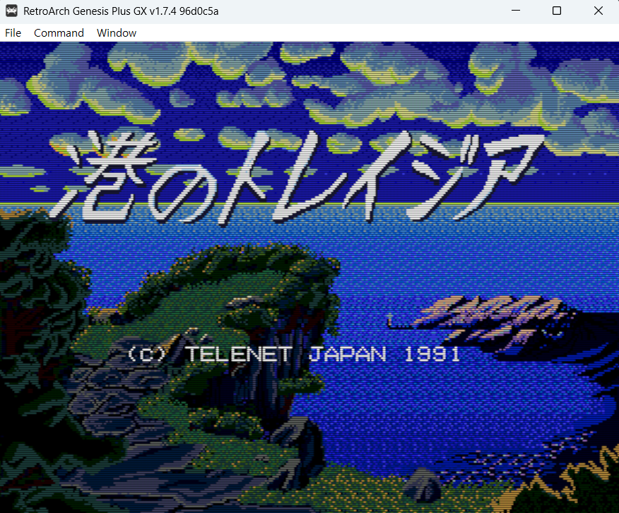
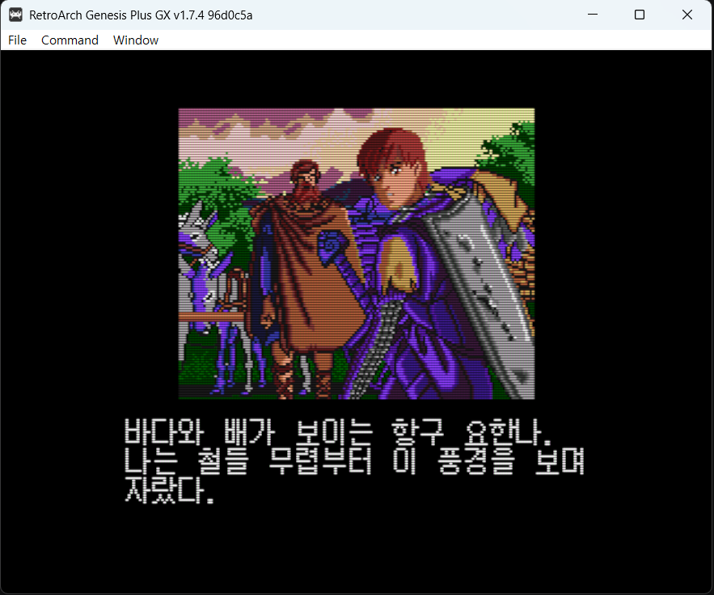
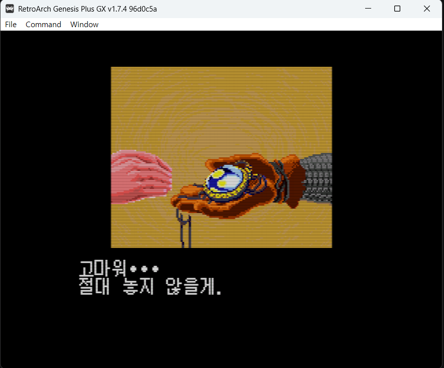
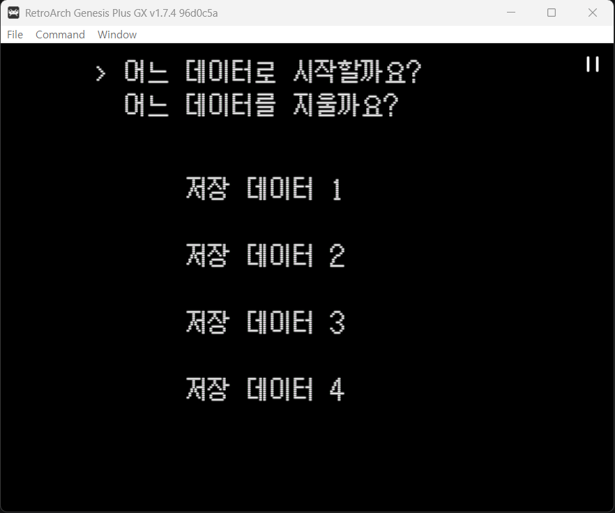
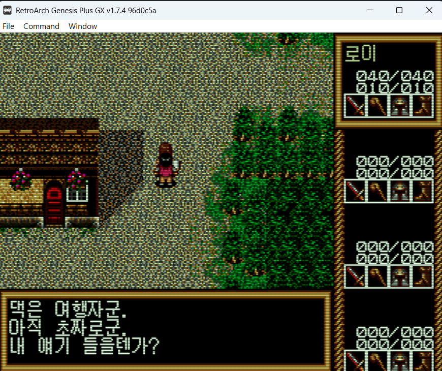
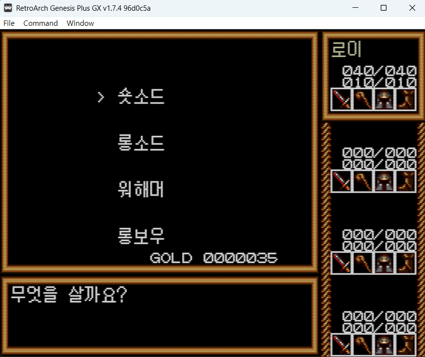
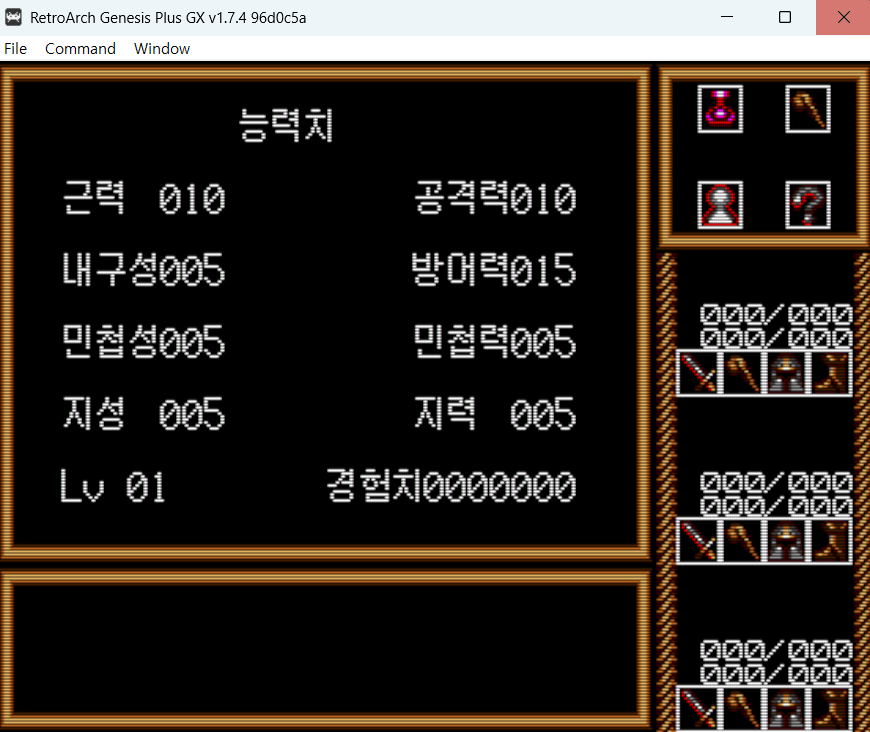
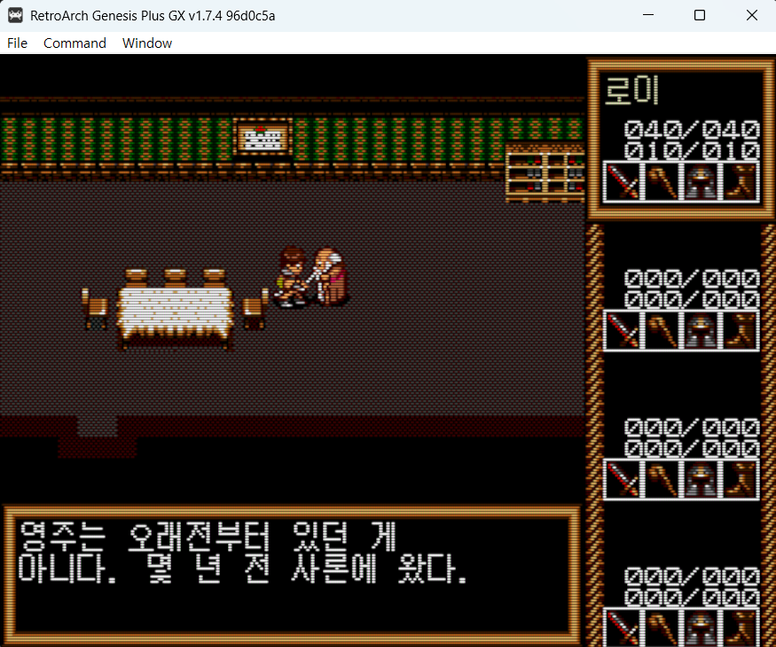

# 항구의 트레이지아 (港のトレイジア) 한글화 패치

텔레네트 재팬 1991년작 메가드라이브 RPG **항구의 트레이지아(Minato no Traysia)** 의 한글화 패치입니다.

> 🚧 **v0.3 — 개발 중** — 오프닝부터 엔딩까지 **본편 대사 번역을 마쳤습니다.**
> 인게임 검증이 남아 있어 개발 중으로 둡니다.

## 다운로드

**준비 중** — 번역이 더 진행된 뒤 배포할 예정입니다.

## 진행 상황

| 항목 | 상태 |
|------|------|
| 폰트 (12×12 한글 글리프 763자) | ✅ 완료 |
| 오프닝·엔딩 나레이션, 이별 장면 | ✅ 완료 |
| 캐릭터 이름 / 상태창 / 저장 화면 | ✅ 완료 |
| **아이템·무기·방어구·마법 205종** | ✅ 완료 |
| 상점·여관·의사·도장·전투 메시지 | ✅ 완료 |
| 1장 사론 왕국 | ✅ 완료 |
| 2장 사막(아이유브·류드)·검장의 마을 | ✅ 완료 |
| 3장 지하 제국 산드라 (13개 거리) | ✅ 완료 |
| 4장 북쪽 신전·수행의 탑·최종 결전 | ✅ 완료 |
| 최종장 요한나 귀환·엔딩 | ✅ 완료 |
| 예/아니오 선택지 | ❌ 미해결 (그래픽 추정) |
| 타이틀 로고 | ❌ 미해결 (리소스 미발견) |

**본편 대사 1,242곳 번역 완료.** 남은 미번역은 코드 영역이 우연히 SJIS로 해석된
오탐이며, 실제 화면에 나오는 대사가 아닙니다.

## 스크린샷

| | |
|---|---|
|  |  |
|  |  |
|  |  |
|  |  |

## 원본 롬 정보

```
Minato no Traysia (Japan).md
크기: 1,048,576 bytes (1MB)
MD5:  75d911e5dc04c429c2f6d64332021b2b
```

패치 적용 결과물:

```
크기: 1,048,576 bytes (변동 없음)
MD5:  06a475c3b162766d297bb0b7b476d1bc
```

## 적용 방법

패치 배포 시 다른 게임과 동일하게 xdelta 형식으로 제공할 예정입니다.

## 기술 개요

- **텍스트 인코딩** — Shift-JIS 기반이지만 **청음 히라가나·구두점은 1바이트**(0xA0~0xDD)로
  저장되고 탁음·카타카나·한자만 전각 2바이트입니다. 렌더러가 표 `0x1898`(62엔트리)로
  전각 변환합니다. 전각쌍만 훑으면 NPC 대사 대부분을 놓칩니다.
- **폰트** — `0xE0000`, **12×12 1bpp, 글리프당 18바이트**(행 경계 없이 12비트씩 팩킹).
  JIS 제1+2수준 7,281자가 들어 있습니다.
- **한글화 방식** — 렌더러 훅 없이 **원본이 안 쓰는 한자 슬롯에 한글 글리프를 심고**
  번역문에 해당 SJIS 코드를 씁니다. 글리프 인덱스가 0xAA 이상이라 폭이 자동으로 12px 고정됩니다.
  글꼴은 굴림 12px.
- **슬롯 제약** — 인덱스 계산(`0x1636`)의 `andi.w #$1F7F` 때문에 **도달 가능한 인덱스는
  339~3346뿐**입니다. 폰트에 실재하는 제2수준(3347~)은 렌더러가 가리키지 못합니다.
  번역으로 덮인 자리의 한자는 슬롯을 회수하도록 해서, 번역이 늘수록 예산도 함께 늘어납니다.
- **번역은 in-place** — 원문 바이트 길이를 넘길 수 없습니다. 원문 히라가나가 1바이트인데
  한글은 2바이트라 문장을 상당히 압축해야 합니다.

## 변경 이력

### v0.3 (2026-07-29) — 개발 중
- **본편 대사 1,242곳 번역 완료** (오프닝~엔딩 전편)
- 한글 글리프 763자, 길이 초과 0건, 슬롯 충돌 0건

### v0.2 (2026-07-29)
- 텍스트 인코딩·폰트·렌더러 파이프라인 전체 해독
- 폰트 슬롯 침범으로 인한 진행 불가 버그 수정
- 오프닝·엔딩 나레이션, 아이템 205종, 상점·전투·상태창, 첫 마을 NPC 번역
