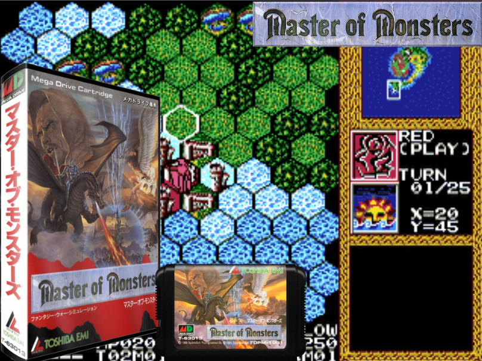

# 마스터 오브 몬스터즈 (Master of Monsters) 한글화 패치

시스템소프트 개발, 토시바 EMI 발매(1991)의 메가드라이브 판타지 워 시뮬레이션
**마스터 오브 몬스터즈(マスター・オブ・モンスターズ)** 의 한글화 프로젝트입니다.

> 📋 **준비 중** — 롬 분석 착수 전 단계입니다. 아직 패치 파일은 제공하지 않습니다.

## 게임 소개

헥스 맵에서 마스터(소환사)가 몬스터를 소환·육성해 상대 마스터를 쓰러뜨리는 턴제 전략
시뮬레이션입니다. 지형과 유닛 상성, 경험치에 따른 진화 시스템이 특징이며,
[슈퍼 대전략](../super-daisenryaku/)과 같은 시스템소프트 계열 작품입니다.

## 진행 상황

| 항목 | 상태 |
|------|------|
| 롬 구조 분석 (폰트·텍스트 인코딩) | 📋 예정 |
| 텍스트 추출 | 📋 예정 |
| 번역 | 📋 예정 |
| 한글 폰트·렌더링 | 📋 예정 |

## 참고

같은 개발사(시스템소프트) 작품인 [슈퍼 대전략](../super-daisenryaku/)에서 확보한
분석 기법(타일 코덱, 16×16/8×8 폰트 뱅크 구조, 코드 스트림 방식)이 이 작품에도
적용될 가능성이 있어, 해당 프로젝트의 도구를 재활용할 예정입니다.
