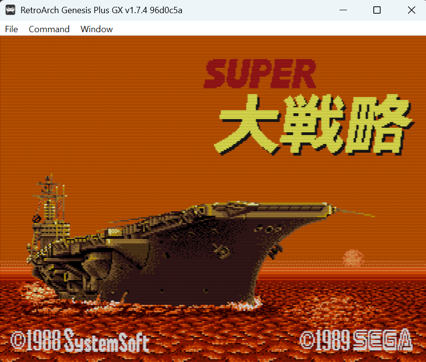
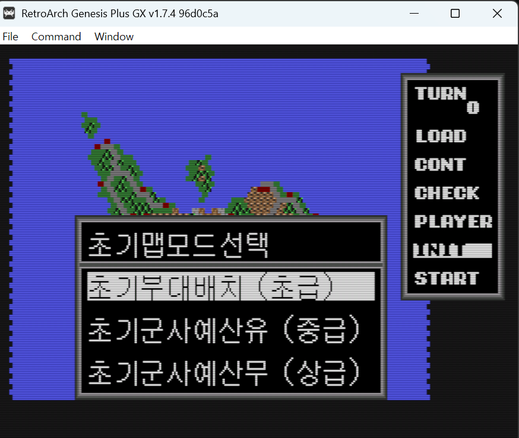
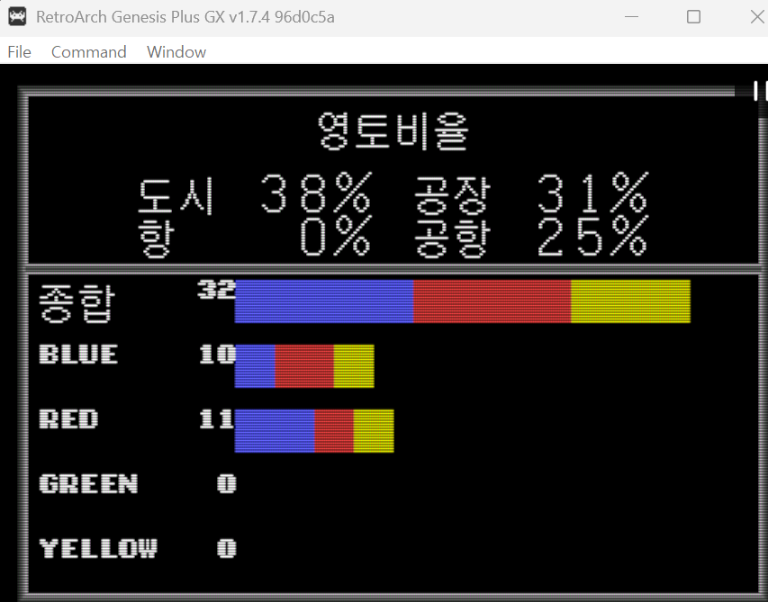
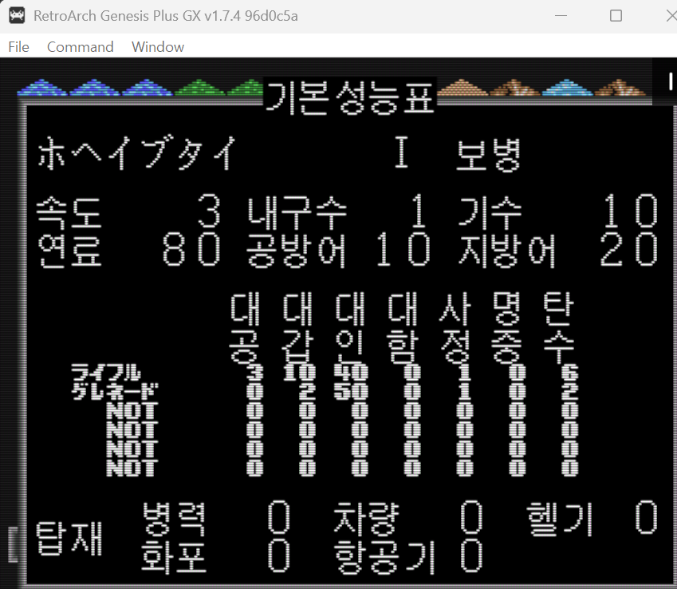
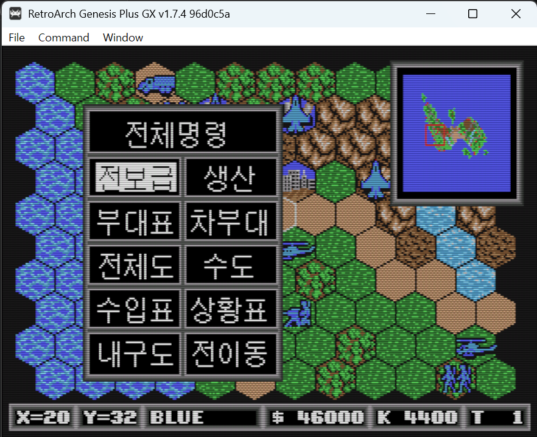
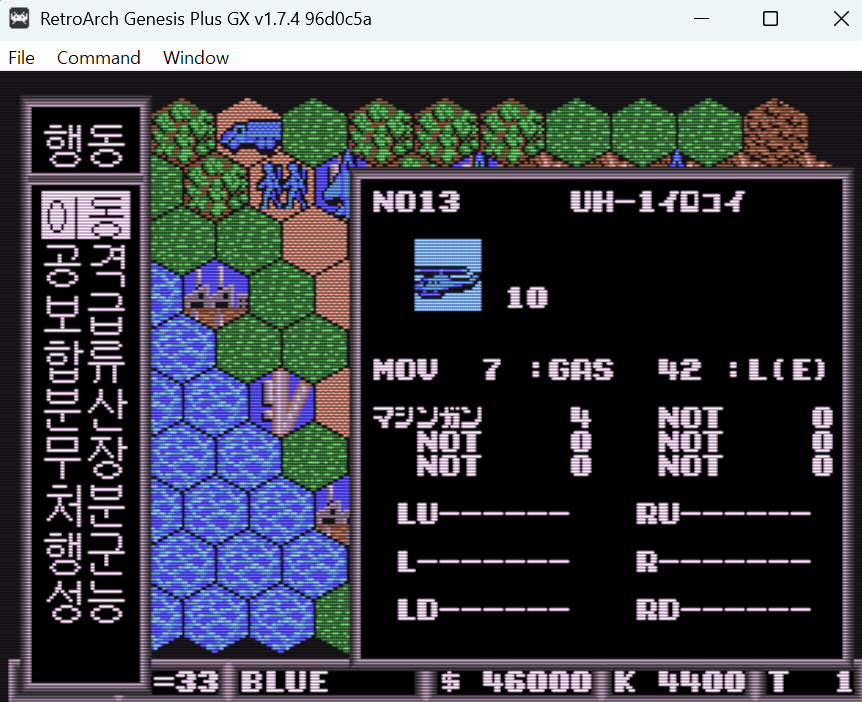

# 슈퍼 대전략 (Super Daisenryaku) 한글화 패치

세가 1989년작 메가드라이브 턴제 워 시뮬레이션 **슈퍼 대전략(スーパー大戦略)** 의 한글화 패치입니다.

> ⚠️ **개발 중 (v0.1)** — UI 텍스트 위주로 한글화가 진행 중이며, 아직 배포 파일은 제공하지 않습니다.

## 진행 상황

| 항목 | 상태 |
|------|------|
| 메뉴·명령 라벨 (전체명령/생산/부대표/이동/공격…) | ✅ 완료 |
| 화면 헤더 (영토비율/기본성능표/종류별기수표…) | ✅ 완료 |
| 상태·오류 메시지 60여 종 | ✅ 완료 |
| 유닛 분류표 (전투기/전차/보병…) | ✅ 완료 |
| 초기 맵 모드 선택 | ✅ 완료 |
| **유닛명** (F-4팬텀, 보급부대 등 60종) | 🔧 작업 중 |
| **무기명** (머신건/라이플 등) | 🔧 작업 중 |
| **우측 시스템 메뉴** (TURN/LOAD/CHECK…) | 📋 예정 |
| **타이틀 로고·사전 렌더 그래픽** | 📋 예정 |

## 스크린샷

| | |
|---|---|
|  |  |
|  |  |
|  |  |

## 기술 개요

- **텍스트 시스템**: 폰트 2종 + 코드 스트림 (사전 렌더 그래픽 아님)
  - 16×16 폰트(한자·카나·ASCII 405자) — 메뉴/헤더/메시지, 코드 `0x200 + 4k`
  - 8×8 폰트(ASCII·반각 카나 155자) — 유닛명/숫자/영문 라벨
- **한글화 방식**: 렌더러 훅 없이 **폰트 뱅크 교체 + 코드 재작성**
  - 롬 512KB → 1MB 확장 후 확장 폰트 뱅크 배치, 폰트 참조 3곳 패치
  - 한글 글리프는 GulimChe 16px 비트맵(16×16), Galmuri7(8×8) 사용
- 현재 UI 문자열 **186개 전량 교체** 완료

## 원본 롬 정보

```
Super Daisenryaku (Japan).md
크기: 524,288 bytes (512KB)
MD5:  91d40557943ca9a2dd085292fc40e03a
```

## 배포 예정

한글화가 일정 수준에 도달하면 xdelta 패치를 [Releases](https://github.com/evegood99/KR_PATCH_AGES/releases)에 배포할 예정입니다.
