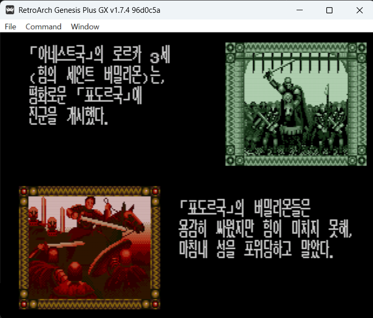
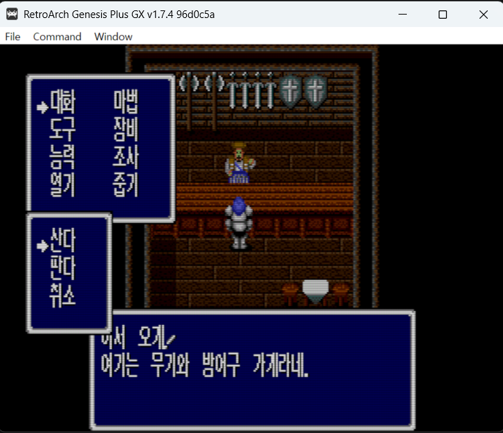
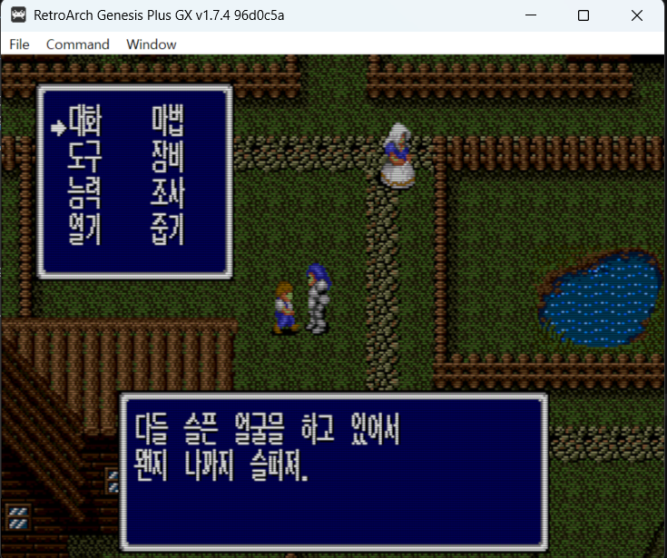
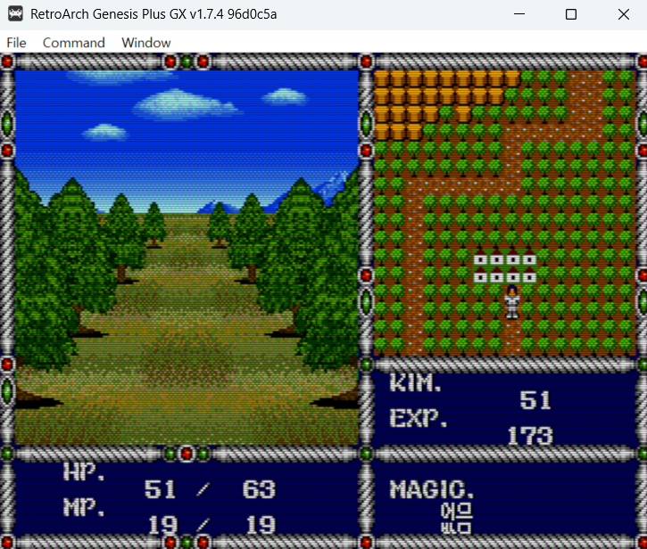
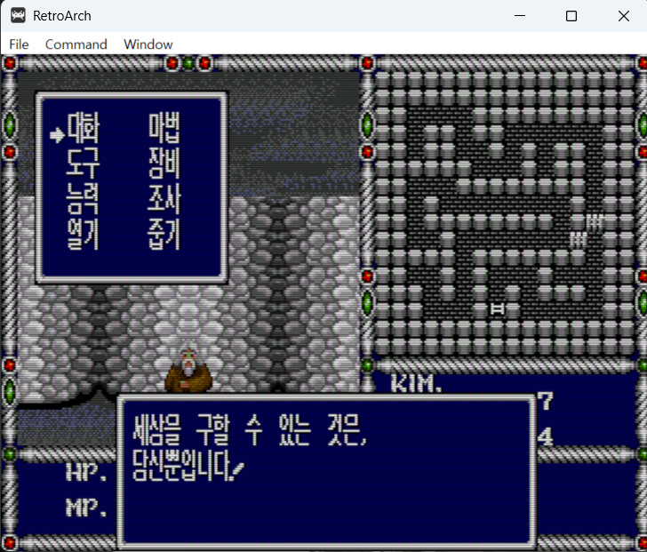

# 버밀리온 (Vermilion) 한글화 패치

세가 1989년작 메가드라이브 액션 RPG **버밀리온(ヴァーミリオン)** 의 한글화 패치입니다.

- **현재 버전**: v0.9 (테스트 중)
- **패치 형식**: xdelta (원본 640KB → 패치 후 1MB 확장)

## 스크린샷

| | |
|---|---|
|  |  |
|  |  |
|  |  |

## 원본 롬 정보

패치는 아래 원본에만 적용됩니다. 적용 전 해시를 확인하세요.

```
Vermilion (Japan).md
크기: 655,360 bytes (640KB)
MD5:  5def9f18e261692490fd53c1adafcc91
SHA1: 697fb165051179a2bbca77c8cfd0c929e334f8c1
```

패치 적용 결과물:

```
크기: 1,048,576 bytes (1MB)
MD5:  a94ee29eb0bb480faa023625085e68d8
```

## 다운로드

패치 파일은 **[Releases](https://github.com/evegood99/KR_PATCH_AGES/releases/tag/vermilion-v0.9)** 에서 받으세요:
`vermilion_kr_v0.9.xdelta`

## 적용 방법

**GUI (권장)** — [Delta Patcher](https://github.com/marco-calautti/DeltaPatcher/releases)
1. Original file: 원본 롬 선택
2. XDelta patch: 다운로드한 `vermilion_kr_v0.9.xdelta` 선택
3. Apply patch

**CLI**
```
xdelta3 -d -s "Vermilion (Japan).md" vermilion_kr_v0.9.xdelta vermilion_kr.md
```

## 한글화 내용

- 전체 대사·이벤트 번역 (오프닝 데모, 본편, 엔딩, 스태프롤 포함)
- 메뉴·상점·전투 메시지·아이템/마법명 번역
- 이름 입력 화면 한글 48음절 그리드 지원
- 타이틀 로고 "버밀리온" 한글 그래픽
- 타이틀 메뉴 시작/이어하기
- 8x16 반각 한글 폰트(KS완성형 2,350자) 동적 렌더링

## 알려진 제한

- 다중 창이 겹치는 화면(상점 등)에서 **드물게 글자가 다른 글자로 바뀌어 보일 수 있음** — 메가드라이브 VRAM 타일 한계(동시 64슬롯)로 인한 구조적 제약이며, 창을 다시 열면 정상 표시됩니다. 진행에는 영향 없음.
- 필드 HUD의 MAGIC 칸은 4음절까지 표시.

## 변경 이력

### v0.9 (2026-07-24)
- 최초 공개 테스트 버전
- 전체 스크립트 번역(약 1,200개 문자열), 렌더러 훅 12종
- 이름 입력 한글 그리드, 타이틀 로고 한글화, 엔딩/스태프롤 한글화
- 소프트 리셋 시 글자 깨짐 수정
