# 모두의 골프 포터블 2 (みんなのGOLF ポータブル２) 한글화 패치

소니 2007년작 PSP 골프 게임 **모두의 골프 포터블 2 (Everybody's Golf Portable 2)** 의 한글화 작업입니다.

> 🚧 **v0.8** — 텍스트 2,978건과 주요 화면 그래픽이 한글화됐습니다.
> 싱글플레이 화면은 결과·획득·VTR까지 처리 완료. 남은 일본어는 주로 온라인 화면입니다.

## 다운로드

**[mgp_kr_v0.8.xdelta — Releases](https://github.com/evegood99/KR_PATCH_AGES/releases/tag/minna-no-golf-portable2-v0.8)**

## 진행 상황

| 항목 | 상태 |
|------|------|
| ISO9660 읽기/쓰기 도구 | ✅ 완료 |
| UMD 구성 파악 (2,883 파일) | ✅ 완료 |
| 실행 파일 분석 (MIPS 디스어셈블러) | ✅ 완료 |
| 리소스 시스템·경로 규칙 | ✅ 완료 |
| `.xb` 컨테이너 구조 | ✅ 완료 |
| **`.xb` 압축 코덱 (LZ + 허프만)** | ✅ **완료** |
| 리소스 추출 (GIM/SGXD/CSV 검증) | ✅ 완료 |
| 텍스트 포맷 (`.bin` 오프셋표 + UTF-8) | ✅ 완료 |
| 폰트 (`ngot14` 14×14 비트맵) | ✅ 완료 |
| 텍스트 추출 (41 리소스 / 4,398줄) | ✅ 완료 |
| 재압축기 (LZ 인코더) | ✅ 완료 |
| `.xb` 재패킹 (바이트 일치 검증) | ✅ 완료 |
| **인게임 한글 출력 확인** | ✅ **완료** |
| ISO 반영 (섹터 재배치) | ✅ 완료 |
| **번역** | 🔶 2,978건 (주 UI 595, 의상·장비 347, 이벤트 대사 380, 코멘트 286 …) |
| **타이틀 화면 그래픽** | ✅ 로고·버튼 한글화 |
| **메인 메뉴 그래픽** | ✅ 버튼 19개 + 상단 띠 5종 한글화 |
| **챌린지 화면 그래픽** | ✅ 챌린지·VS 챌린지 두 화면 (제목·캐릭터·랭크·코스·규칙·카드) |
| **캐릭터 선택 그래픽** | ✅ 제목·등급 탭·이름 23개 등 |
| **최종 확인 그래픽** | ✅ 캐디·시합 형식·랭크·티 등 (코스별 13벌 전부) |
| **인게임 그래픽** | ✅ 라이·샷 평가·포인트 항목·게이지 라벨 등 |
| **랭킹·스코어카드 그래픽** | ✅ 대회명·순위표·조작 안내 |
| **로드 메시지** | ✅ 80장 (코스 소개·게임 안내·축하·캐릭터 소개) |
| **결과·획득 화면 그래픽** | ✅ 랭크·성적표·인정증·카드/아이템 획득·애착도 해금·VS 이름 |

## 스크린샷

| 타이틀 | 메인 메뉴 |
|---|---|
| 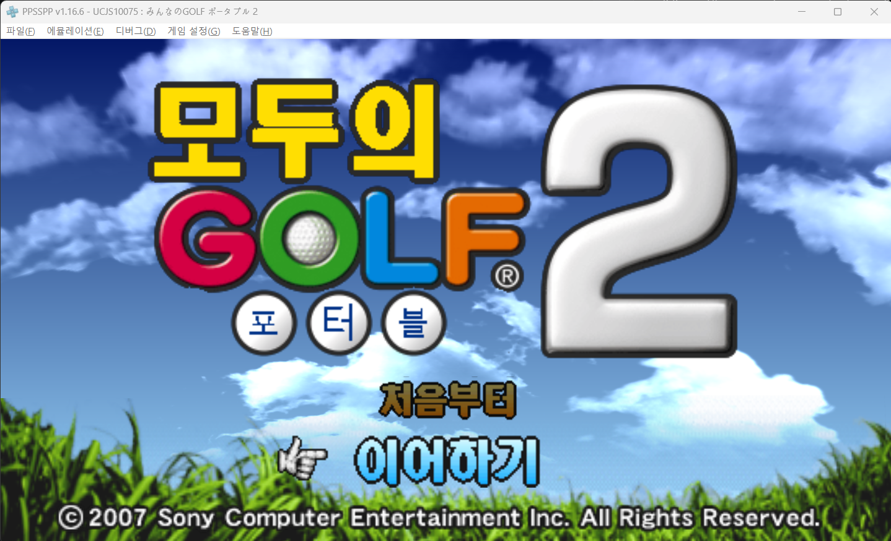 | 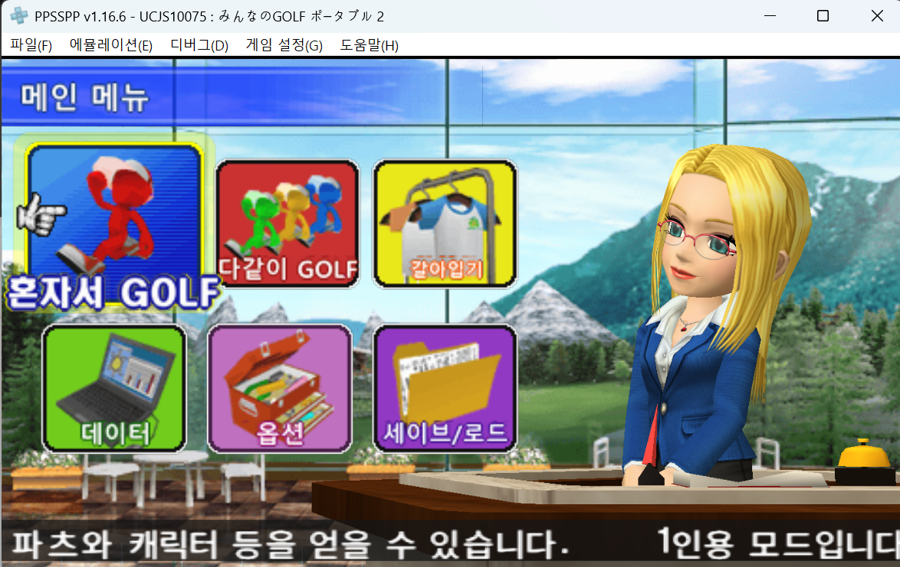 |

| 혼자서 GOLF | 챌린지 |
|---|---|
| 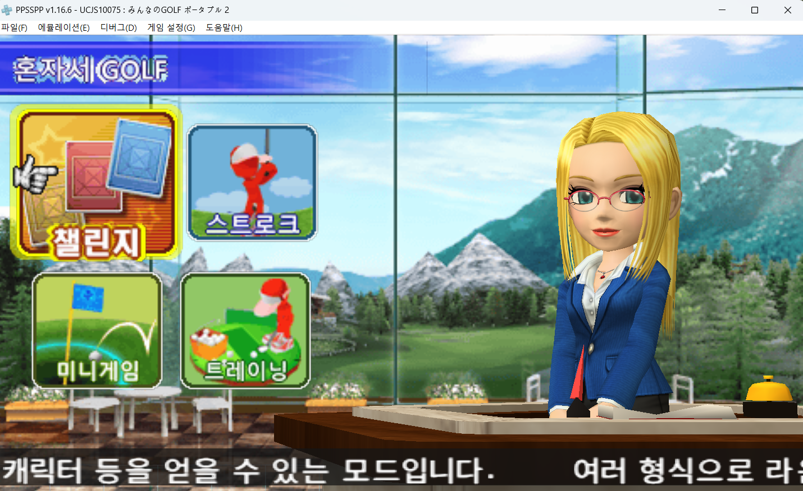 | 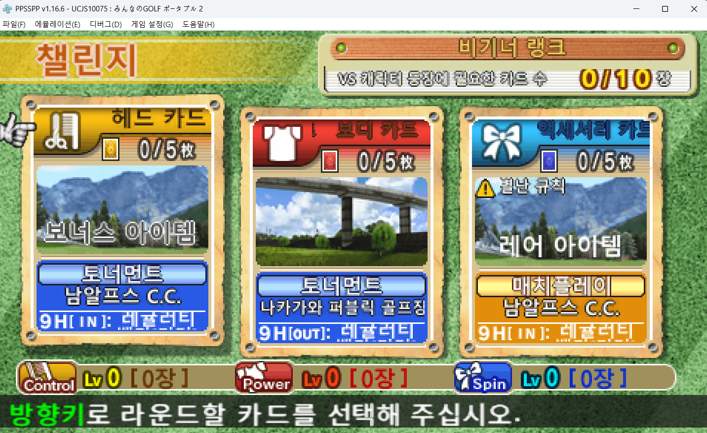 |

| 대회 참가 | 데이터 불러오기 |
|---|---|
| 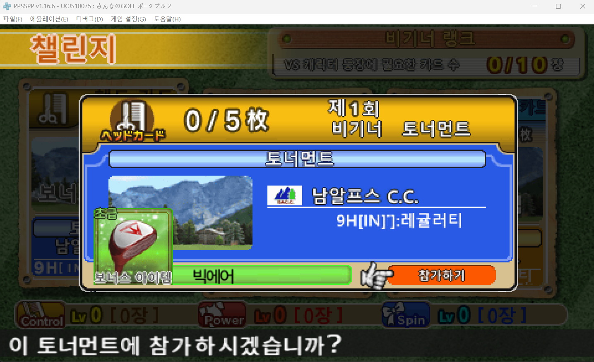 | 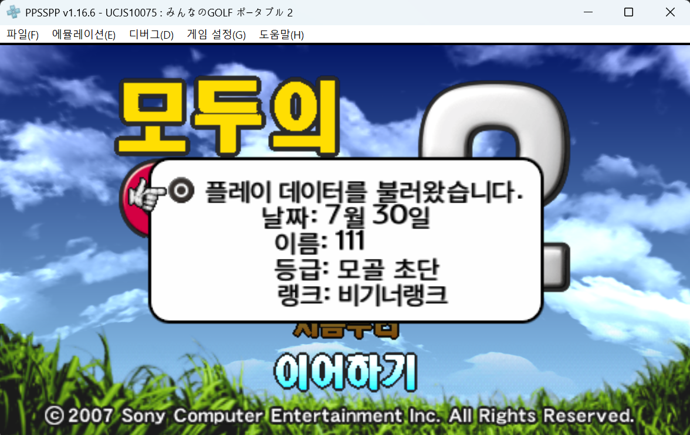 |

| 캐릭터 선택 | 최종 확인 |
|---|---|
| 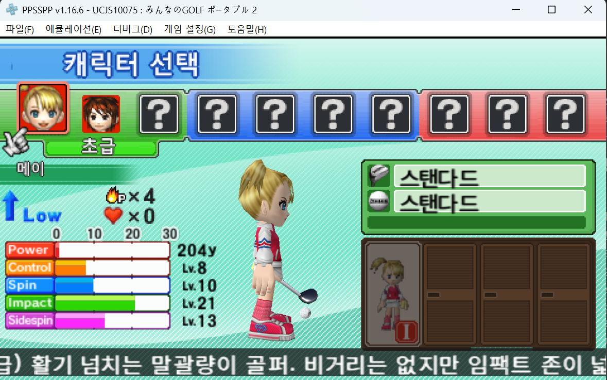 | 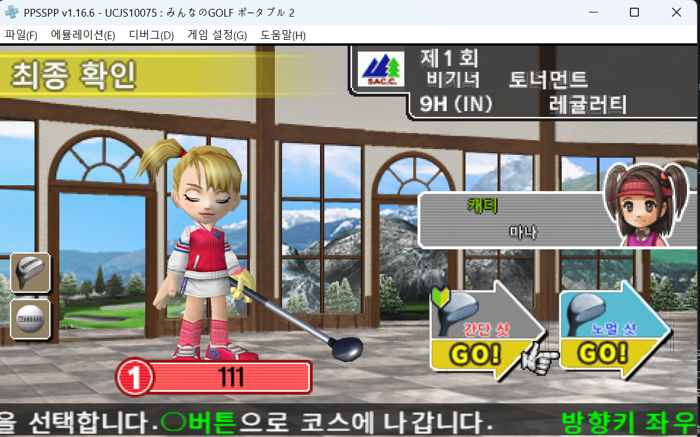 |

| 코스 진입 | 인게임 |
|---|---|
| 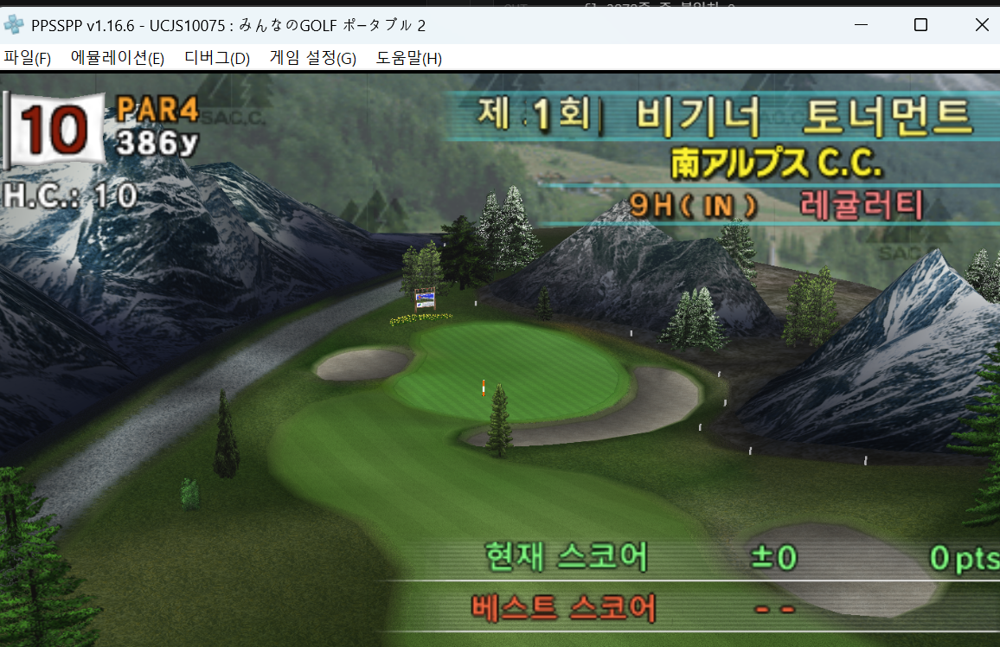 | 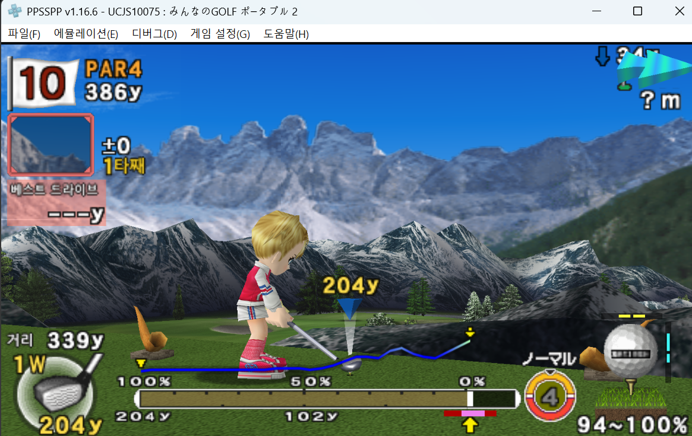 |

| 클리어 보너스 | |
|---|---|
| 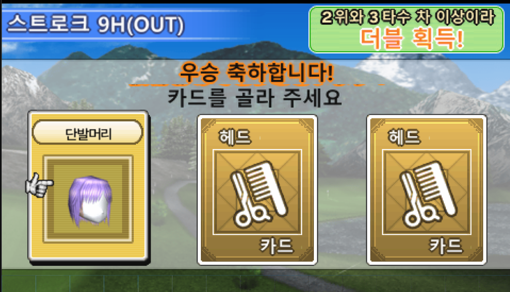 | |

## 적용 방법

원본 ISO(아래 「원본 정보」와 MD5 일치)에 `mgp_kr_v0.8.xdelta` 를 적용합니다.

```
xdelta3 -d -s "Minna no Golf Portable 2 (Japan, Korea) (v1.09).iso" mgp_kr_v0.8.xdelta mgp_kr.iso
```

만들어진 `mgp_kr.iso` 를 PPSSPP 또는 CFW PSP에서 실행하면 됩니다.

```
mgp_kr.iso (v0.8)
MD5: c7ca4320bddb890d7d0a800a4a85626a
```


## 원본 정보

```
Minna no Golf Portable 2 (Japan, Korea) (v1.09).iso
크기: 922,025,984 bytes
MD5:  7c94ccb94b3bb336095af3de0fd912cb
```

| 항목 | 값 |
|---|---|
| DISC_ID | UCJS-10075 |
| TITLE | みんなのGOLF ポータブル２ |
| DISC_VERSION | 1.09 |
| PSP_SYSTEM_VER | 3.72 |

「Japan, Korea」는 같은 UMD가 두 지역에 유통됐다는 뜻이고, **내용은 일본어판**입니다.


## 개발 도구 (`src/tools/`)

| 파일 | 역할 |
|---|---|
| `isolib.py` | ISO9660 순회·읽기·in-place 쓰기 |
| `xb.py` | `.xb` 컨테이너 파서 + 리소스 추출 |
| `lz.py` | LZ·허프만 해제기 (실행 파일에서 이식) |
| `sjis.py` | Shift-JIS 문자열 스캐너 |
| `mips.py` | PSP MIPS 최소 디스어셈블러 (상수·주소 참조 추적) |
| `font.py` | `ngot14` 비트맵 폰트 읽기/쓰기, JIS 색인 변환 |
| `binfmt.py` | 텍스트 `.bin`(오프셋표+문자열) 파싱/재작성 |
| `gim.py` | GIM 텍스처 파싱/스위즐 처리/픽셀 교체 |
| `titlegfx.py` | 타이틀 화면 그래픽 한글화 |
| `build.py` | 한글 패치 빌드 (폰트 주입 → 텍스트 교체 → ISO 반영) |

## 변경 이력

### v0.8 — 2026-08-07
- 결과 화면 결함 6건 수정 (스크린샷 제보 기반, 전부 원인 실측)
  - 「비기너 랭크」 명패 위 일본어 잔해 — 잉크가 상자보다 위에서 시작
  - 「이 아이템을 획득했습니다!」 상단 잘림 — 상자가 잉크보다 7줄 위에 있었음
  - 「2/10」 숫자 윗단 잘림 — 안내문 지우기가 숫자 조판줄(y58)을 침범
  - 「초급/클럽」 주변 잔해 — 상자 재배치, 알약 띠는 열 복사(`copy_x`)로 지움
  - 남아 있던 「枚」 → 「장」 (표에 없던 큰 숫자줄 포함 2곳)
- 「ダブルゲット！」 텍스처를 찾아 번역 — 카드/아이템 획득 제목 3종(`R_ItemGet_w`)
- 캡슐 중복 안내 「이미 갖고 있습니다…」「중복입니다…」 번역
- 애착도 해금 안내 11줄(`R_LoyaltyText`) 번역 — `lovely.xb` 팩 신규 반영
- VS 캐릭터 이름 21종(`R_PCname`)·별난 규칙 8종·매치플레이 「리드!/리치!」 번역
- 증명서(궁서) 획 굵기 — 실기에서 획이 뭉쳐 보여 **원래 굵기로 원복**, 존칭 「殿」→「님」
- VTR 잔여 일본어 한글화 — 성적 분류 배너 4종(칩인 버디 등)·재생/덮어쓰기 금지/삭제·
  티 표기, 그리고 「저장된 데이터가 없습니다.」(반투명 띠 위 글자 — 글자 없는 행을
  같은 열끼리 복사하는 방식으로 띠를 복원하며 해결)
- 검사 도구 확충 — 상자 밖 화소 감사 35케이스 전부 통과

### v0.4 (개발 중) 2026-08-03
- 화면의 일본어는 문자열 테이블이 아니라 **낱말 텍스처를 잘라 붙인 것**임을 확인
  (「第1回 ビギナー トーナメント」 = 네 조각 조합)
- 대회 제목·랭킹표·스코어카드·코스 진입 화면 한글화
- 인게임 라벨 한글화 — 라이·샷 평가·포인트 항목 25종·게이지 표기
- 최종 확인 화면이 **코스마다 다른 팩**을 읽는 것을 확인해 13벌 전부 반영
- 「예/아니오」가 PSP 버튼 모음 텍스처에 있어 **26개 팩에 복제**된 것을 찾아 반영
- VS 챌린지 화면(`mClng2`) 전용 좌표표 신설 — 지금까지 통째로 일본어였음
- 랭크 승격 축하판 9종, 로드 메시지 80장 한글화

### v0.3 / v0.2 (개발 중) 2026-08-01 ~ 08-02
- 챌린지·캐릭터 선택·최종 확인 화면 그래픽 한글화
- 지우기 방식 개선 — 상자만 네모로 지우면 옛 글자의 흐린 가장자리가 남아
  새 글자 뒤로 비친다. 상자에 닿은 잉크를 연결된 만큼 따라가며 지우도록 변경
- 게임이 파일을 **`mgp.ufl`** 로 찾는다는 것을 확인 (디렉터리만 고치면 원본이 읽힌다)

### v0.1 (개발 중) 2026-07-30 ~ 07-31
- 프로젝트 개설, ISO 도구·MIPS 디스어셈블러 작성
- UMD 구성·리소스 시스템·`.xb` 컨테이너 구조 파악
- 실행 파일이 비암호화임을 확인 (코드 역해석 가능)
- **`.xb` 압축 코덱(LZ + 허프만 2단 체인) 해독 완료** — 리소스 추출 동작 확인
- **텍스트 포맷(`.bin` 오프셋표 + UTF-8) 해독**, 실제 게임 문자열 확인
- **폰트 `ngot14`(14×14 1bpp, JIS 제1수준 2,965자) 구조 확정** — 한글화 경로 확보
- **LZ 압축기 작성**(해제기 규격 역산), `.xb` 재패킹 바이트 일치 검증
- **한글 글리프 주입 + ISO 반영 파이프라인 동작 확인** — 173자 주입, 89건 번역 적용
- 커진 파일은 미사용 섹터로 재배치(디렉터리 레코드 both-endian 수정)
- **방식 전환** — 이 게임은 자체 비트맵 폰트가 아니라 **PSP 시스템 폰트(PGF)** 로 그린다.
  `sceFontOpen` 인덱스를 `kr0.pgf`(17)로 바꾸는 4바이트 코드 패치 + 한글 UTF-8 직접 기록으로 변경
- 인게임 한글 출력 확인, 주 UI 메시지 595/601 번역
- **타이틀 화면 그래픽 한글화** — 로고(「모두의 GOLF 포터블 2」)·버튼 2개
- **메인 메뉴 그래픽 한글화** — 버튼 문구 19개 × 3벌, 상단 띠 5종
- 라벨이 **세 벌**임을 확인하고 열별 잉크 상자에 맞춰 다시 그림 (UV 감김으로 인한
  글자 잘림·좌우 뒤바뀜·겹침 해소), 가장자리를 커버리지 기반 안티에일리어싱으로 교체
- 번역 2,978건까지 확대 — 의상·헤어·장비 이름, 이벤트 대사, 매치/랭킹 코멘트
- 안내문 26건을 **표시 폭 기준**으로 축약 (글자 수가 아니라 반각/전각 폭으로 재야 한다)
